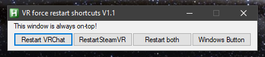

A simple AutoHotkey script that forcefully terminates SteamVR and VRChat to restart the game as quickly as possible. 
- Useful if you crash/freeze 
- Also terminates EAC since that can freeze and get stuck running in the background
- Source code all in vrhotkeys.ahk so you can modify it using Notepad or any other text editor 

The executable is compiled with AutoHotkey built-in but you can also run the script by itself if you install https://www.autohotkey.com. You can also compile it yourself by right clicking the source .ahk file and clicking "Compile Script".
